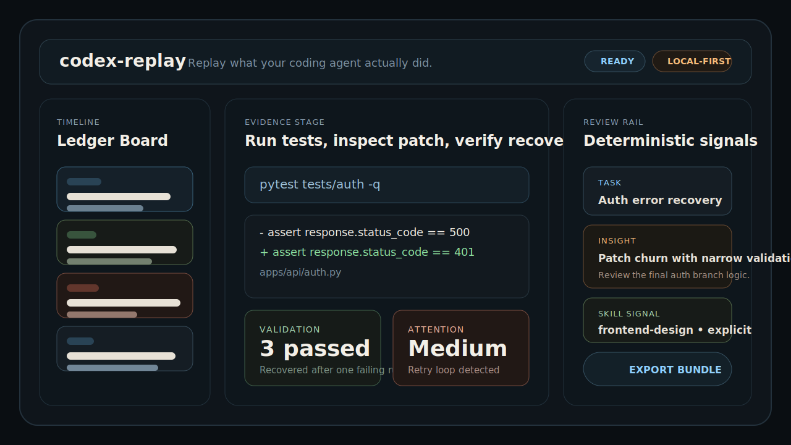

<div align="center">
  <h1>Codex Replay</h1>
  <p><strong>Replay what your coding agent actually did.</strong></p>
  <p>Local-first trace discovery, evidence-first replay, deterministic review signals, and round-trip export bundles for Codex sessions.</p>

  <p>
    <a href="https://github.com/kaiqiangh/codex-replay/actions/workflows/ci.yml"></a>
    <a href="https://github.com/kaiqiangh/codex-replay/actions/workflows/smoke.yml"></a>
    <a href="https://github.com/kaiqiangh/codex-replay/actions/workflows/security.yml"></a>
    <a href="https://github.com/kaiqiangh/codex-replay/actions/workflows/release-hygiene.yml"></a>
  </p>
</div>

<div align="center">
  
</div>

## Why It Exists

Agent runs are hard to review after the fact. Logs are noisy, raw JSONL is not readable, and trust breaks down when you cannot quickly answer basic questions:

- What changed?
- Where did the run fail or recover?
- Which commands, tests, and patches matter?
- Does this run deserve reviewer attention?

`codex-replay` turns local Codex traces into a readable replay surface with a strict evidence trail.

## What You Get In v0.1

- **Import or auto-discover traces** from Codex-managed local paths under `~/.codex`.
- **Inspect runs in a ledger-board replay UI** with timeline, evidence view, and reviewer rail.
- **See deterministic insights** for retry loops, weak validation, patch churn, and unresolved errors.
- **Track explicit and inferred skill usage** without hiding uncertainty.
- **Export round-trip replay bundles** with summaries, insights, skills, raw artifacts, and checksums.

## Quickstart

```bash
pnpm install
uv sync --project services/api --extra dev
make dev
```

Open:

- Web UI: [http://localhost:3000](http://localhost:3000)
- API health: [http://localhost:8000/api/v1/health](http://localhost:8000/api/v1/health)

## Product Shape

### Landing

- `Import trace` for manual JSONL or replay bundle uploads
- `Recent Codex traces` for replayable local artifacts
- `Recent Codex sessions` for metadata-only threads from `session_index.jsonl`

### Replay Inspector

- Left rail: virtualized timeline with jump filters for errors, diffs, tests, and skills
- Center pane: evidence stage for commands, diffs, logs, messages, and raw payloads
- Right rail: summary, validation trail, review attention, insights, skills, and export

## Local-First By Design

`codex-replay` is intentionally narrow in v0.1:

- Codex only
- single-user local runtime
- SQLite + filesystem storage
- no auth
- no cloud sync
- no live streaming

Discovery is limited to Codex-managed locations:

- `~/.codex/session_index.jsonl`
- `~/.codex/sessions/**/*.jsonl`
- `~/.codex/archived_sessions/*.jsonl`

Rollout artifacts are imported automatically. Session-index rows remain metadata-only until a replayable trace exists.

## Architecture

| Area           | Role                                                                       |
| -------------- | -------------------------------------------------------------------------- |
| `apps/web`     | Next.js 15 frontend for landing, catalog, and replay inspector             |
| `services/api` | FastAPI service for discovery, import, normalization, insights, and export |
| `data/`        | Managed SQLite database, copied artifacts, blobs, and exported bundles     |
| `scripts/ci`   | Shared smoke, hygiene, and release packaging logic                         |

## Development

```bash
make dev        # web + api
make dev-web    # next.js only
make dev-api    # fastapi only
make test       # backend pytest + web tests
make smoke      # local smoke checks against running services
make build      # production web build
```

Environment defaults:

```bash
NEXT_PUBLIC_API_BASE_URL=http://localhost:8000/api/v1
CODEX_REPLAY_CODEX_HOME=$HOME/.codex
CODEX_REPLAY_DATA_DIR=./data
CODEX_REPLAY_DB_PATH=./data/replay.db
CODEX_REPLAY_DISCOVERY_INTERVAL=300
```

## GitHub Automation

This repo now ships with verification and release hygiene workflows:

- **CI**: repo hygiene, API tests, web tests, and production build checks
- **Smoke**: boots both services, imports a fixture trace, verifies replay routes, and exports a bundle
- **Security**: gitleaks, dependency audits, and CodeQL
- **Release Hygiene**: tag-driven verification and release artifact packaging with checksums

## Privacy And Security

- Imported traces are copied into managed local storage and the original Codex files are never mutated.
- Unknown provider payloads are preserved as raw evidence instead of being dropped.
- Secrets and dependency scanning run in GitHub Actions through the `Security` workflow.

## Roadmap

- richer replay visualizations for large runs
- broader deterministic insight coverage
- stronger artifact browsing and diff ergonomics
- future adapter hooks for non-Codex providers

## Contributing

Issues, focused PRs, and reproducible traces are welcome. Keep changes local-first, evidence-forward, and deterministic where possible.

## License

[MIT](./LICENSE)
